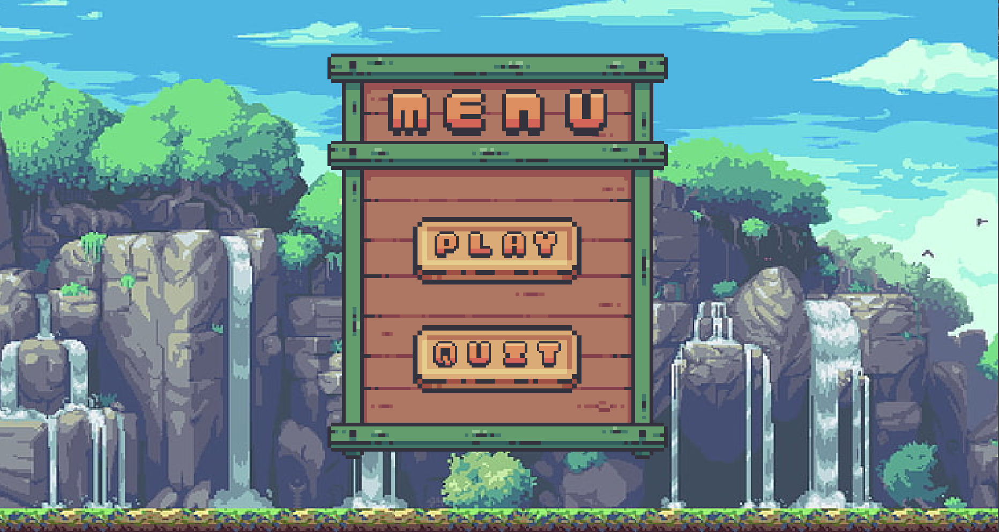
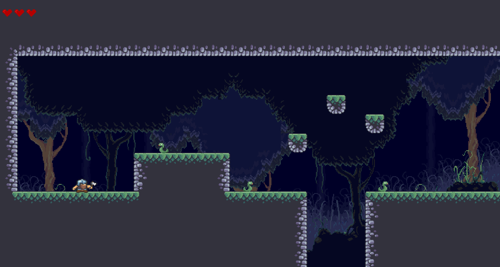

# Java Game - 2D Platformer Game
# Table of contents
- [Description](#description)
- [Folder Structure](#Folder-Structure)
- [Getting Started](#Getting-started)
    - [Our Team](#our-team)
    - [Dependencies](#dependencies)
    - [Installation](#installation)
    - [Contributing](#contributing)
    - [About this project](#about-project)
        - [Game Thread](game-thread)
        - [Character Animations](#character-animation)

## Description <a name="description"></a>
---
A simple action game which can move character (run, jump, attack) between point in the environment 



## Folder Structure
---
.
├── .idea                   
├── res                     
│   ├── entities            
│   ├── inputs              
│   ├── game states
│   ├── main               
│   ├── ui 
│   └── utilz     
└── README.md

## Getting Started
---
### 1. Our Team
|No  | Name |
|-----|-------|
|1     | Vu Tu Hoc|
|2     | Le Minh Hung|
|3     | Le Pham Thuy Tien|
### 2. Dependencies
- Programming language: Java
- JDK: 17
### 3. Installation
```
# Clone this repository
$ git clone https://github.com/hoc2000/java_game_platformer.git
```

### 4. Contributing
1. Fork it
2. Create your feature branch (`git checkout - b develop_branch`)
3. Commit your changes (`git commit -m "New commit"`)
4. Push to the branch (`git push origin develop_branch`)
5. Create a new Pull Request

### 5. About this project
#### a. Game Thread